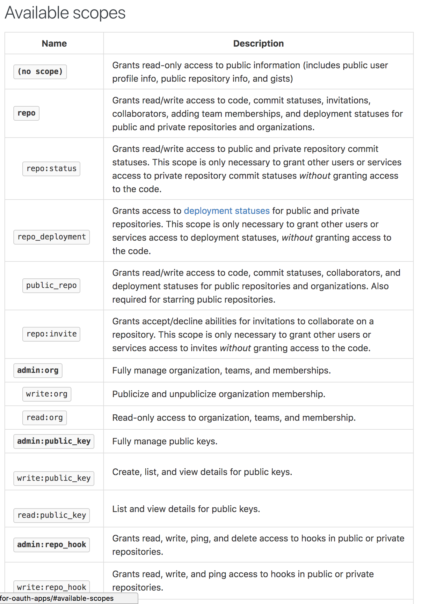
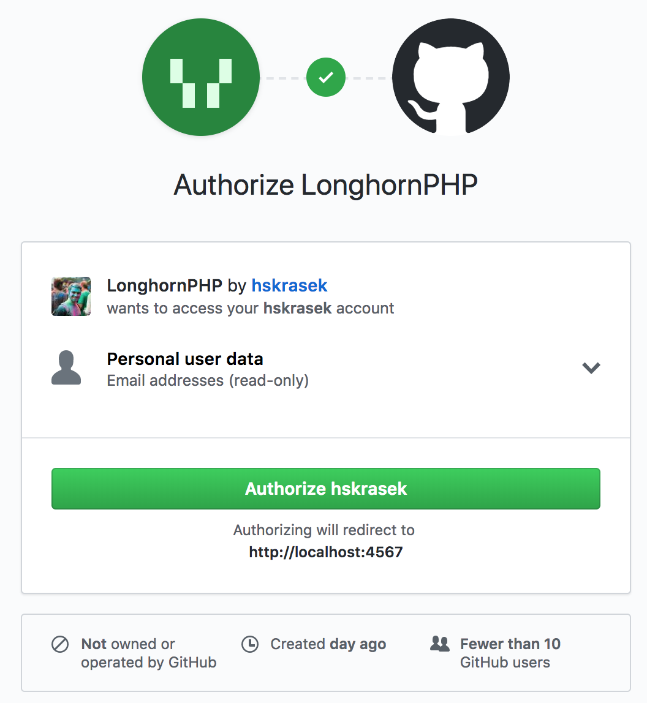
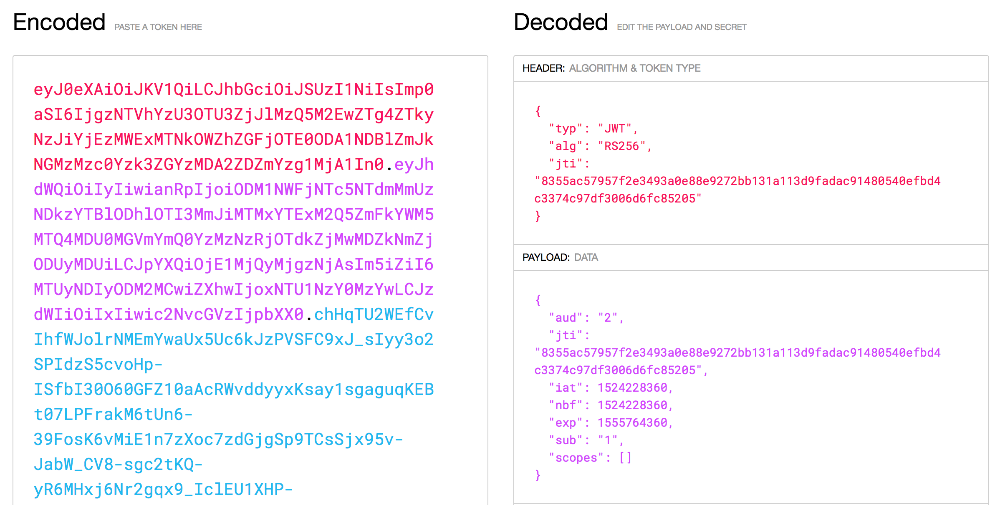
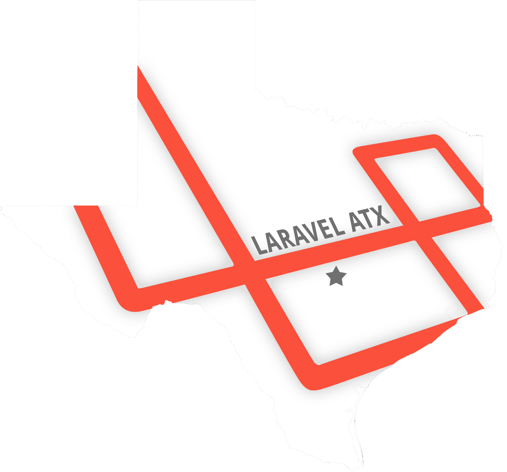

theme: Work Projectors
slidenumbers: true
build-lists: true
footer: Papers, Please! Authentication with Laravel Passport — @*hskrasek*

# [fit] Papers, Please!

# [fit] Authentication with 

# [fit] Laravel **Passport**

---

# [fit] API Authentication Made **Easy**

APIs typically use tokens to authenticate and do not maintain session state between requests.

^ Laravel makes API authentication a breeze using Laravel Passport, which provides a full OAuth2 server implementation for your Laravel application in a matter of minutes.

---

# [fit] Installation

* `composer require laravel/passport`
* `php artisan migrate`
* `php artisan passport:install`

^ The service provider that comes bundled with Passport registers its own database migration directory. After installing the package it's suggested to migrate your database. These migrations will create the tables your application needs to store clients and access tokens.

^ After you migrate your database you'll want to run the `passport:install` command. This command creates the encryption keys needed to generate secure access tokens. Additionally it'll create "personal access" and "password grant" clients

---

```php
<?php

namespace App;

use Laravel\Passport\HasApiTokens;
use Illuminate\Notifications\Notifiable;
use Illuminate\Foundation\Auth\User as Authenticatable;

class User extends Authenticatable
{
    use HasApiTokens, Notifiable;
}
```

^ After you install Passport you'll want to add the `HasApiTokens` trait to your User model. This trait provides a few helper methods which allow you to access the authenticated users token and scopes.

---

[.hide-footer]

```php
<?php

namespace App\Providers;

use Laravel\Passport\Passport;
use Illuminate\Support\Facades\Gate;
use Illuminate\Foundation\Support\Providers\AuthServiceProvider as ServiceProvider;

class AuthServiceProvider extends ServiceProvider
{
    /**
     * The policy mappings for the application.
     *
     * @var array
     */
    protected $policies = [
        'App\Model' => 'App\Policies\ModelPolicy',
    ];

    /**
     * Register any authentication / authorization services.
     *
     * @return void
     */
    public function boot()
    {
        $this->registerPolicies();

        Passport::routes();
    }
}
```

^ Afterwards you'll need to call the Passport::routes method in the boot method of your AuthServiceProvider. It doesn't have to be the AuthServiceProvider, it can be any providers boot method. But the AuthServiceProvider makes the most sense.

^ These routes are necessary for issuing and revoking access tokens, clients and personal access tokens

---

# [fit] And finally...

```php
'guards' => [
    'web' => [
        'driver' => 'session',
        'provider' => 'users',
    ],

    'api' => [
        'driver' => 'passport',
        'provider' => 'users',
    ],
],
```

^ Updating the api driver to passport will instruct the framework to use Passports TokenGuard for authenticating API requests

---

# [fit] Frontend Quickstart

While *Passport* ships with consumable JSON APIs, it also comes with pre-built *Vue* components you may use.

* `php artisan vendor:publish --tag=passport-components`

^ Obviously building a frontend that interacts with these APIs can be time consuming, so Passport also includes pre-built Vue components that you can use as example implementations or as a starting point for own implementation.

---

```js
Vue.component(
    'passport-clients',
    require('./components/passport/Clients.vue')
);

Vue.component(
    'passport-authorized-clients',
    require('./components/passport/AuthorizedClients.vue')
);

Vue.component(
    'passport-personal-access-tokens',
    require('./components/passport/PersonalAccessTokens.vue')
);
```

```html
<passport-clients></passport-clients>
<passport-authorized-clients></passport-authorized-clients>
<passport-personal-access-tokens></passport-personal-access-tokens>
```

^ After publishing and registering the components, you can drop the following components into your apps templates to get started creating clients and personal access tokens

---

# [fit] Consuming Your API With JavaScript

When building an API, it can be extremely useful to be able to consume your own API from your JavaScript application.

^ This approach to API developments allows your own application to consume the same API that you share with the world. Typically if you consume your API from your JavaScript application, you'd need to manually send an access token to the application and pass it with each request.

---

```php
'web' => [
    // Other middleware...
    \Laravel\Passport\Http\Middleware\CreateFreshApiToken::class,
],
```

```js
window.axios.defaults.headers.common = {
    'X-Requested-With': 'XMLHttpRequest',
};
```

This Passport middleware attaches a `laravel_token` cookie to outgoing requests, containing an encrypted JWT.

^ Passport includes a middleware that can handle this for you though. This middleware will attach a laravel_token cookie to your outgoing responses. This cookie will contain an encrypted JWT that Passport will use to authenticate API requests from your JavaScript application.

---

# [fit] Deploying Passport

When deploying for the first time, you'll likely need to run _`passport:keys`_

^ Sooner or later it'll be time to deploy your application to production for the first time. When you do you'll likely need to run the passport:keys command. This command generates the encryption keys needed to generate access tokens. Encryption keys should not be committed into source code, as it could allow someone malicious to create access tokens of their own, outside of the control of your application.

---

# [fit] Token Lifetimes

By default, Passport issues long-lived tokens

```php
/**
 * Register any authentication / authorization services.
 *
 * @return void
 */
public function boot()
{
    $this->registerPolicies();

    Passport::routes();

    Passport::tokensExpireIn(now()->addDays(15));

    Passport::refreshTokensExpireIn(now()->addDays(30));
}
```

^ The default tokens expire after one year. If you'd like to set your tokens to live longer, or shorter you may use the tokensExpireIn and refreshTokensExpireIn methods. Sticking with a common theme, these methods should be called from the boot method of your AuthServiceProvider.

---

# [fit] Issuing Access Tokens

Using OAuth2 with authorization codes is how most developers are familiar with OAuth2. Think _Facebook_, _Google_, _Github_.

^ When using authorization codes, a client application will redirect a user to your server where they'll either approve or deny the request to issue an access token.

---

# [fit] Managing Clients

There are many ways to create clients using _Passport_

* `passport:client` command
* JSON API

^ Developers building applications that need to interact with your application's API will need to register their application with yours by building a "client". Typically this will consist of providing the name of their application and a URL that your application will redirect to after approving or denying the request for authorization.

^ The easiest way to create a client is using the Artisan command. This command is helpful for testing your OAuth2 functionality

^ Obviously your users won't be able to use the client command... or if they can you have a serious security breach. Passport instead provides a JSON API that you can use to create clients to save you the trouble of creating your own controllers for creating, updating, deleting clients.

---

# [fit] Requesting Tokens

You can request tokens using the following methods

^ Once a client has been created, developers may use their client ID and secret to request tokens through the various grant types

---

# [fit] **Authorization** Grant

A redirection-based flow, the client redirects to the authorization server

^ The authorization code grant is used to obtain both access and refresh tokens and is optimized for confidential clients.

^ Add an explanation for when/why you'd use this grant. Typically is for third party clients that are secure.

---

[.hide-footer]


^ First you'll make a redirect request to your applications server with a client ID, redirect URI, and scopes; something we'll talk about later.

^ Once the user approves the request, your application will redirect back to the previously provided redirect URI with an authorization code. The redirect URI provided needs to match what was provided when creating the client.

^ Finally you use that code plus the client ID, secret, redirect URI to make the final request to get your access token


---

# [fit] **Refresh** Grant

Access tokens eventually expire; some grants respond with refresh tokens allowing the client to get a new access token.

^ If your application has short lived tokens, user will need to refresh their tokens. If the grant provides a refresh token it can be used to get a new access token without requiring the user to be redirected

---

[.hide-footer]


^ As you can see here, you're able to request a new access token without any user input with a refresh token. This allows you to keep a seamless experience with the user once they login, as long as the refresh token is valid

---

# [fit] **Password** Grant

This grant allows your other first-party clients, such as mobile apps, to obtain an access token using an email and password.

^ With this grant the client will ask the user for their authorization credentials, typically a username and password. Allows you to isssue access tokens securily without having to redirect your users through the entire flow.

---

[.hide-footer]


^ This grant shines when you control both the client application and the resource that the client is interacting with. This grant requires you to be able to trust the client to store it's secret securely, as well as being trusted with the users credentials.

^ A good example of this would be the Facebook client apps for iPhone and Android interacting with the Facebook service.

---

# [fit] **Implicit** Grant

Similar to the authorization code grant; however, the token is returned to the client without an authorization code.

^ This grant is commonly used for JavaScript or mobile applications where the client credentials can't be securely stored.

---

```php, [.highlight: 1-7, 16-17]
/**
 * Register any authentication / authorization services.
 *
 * @return void
 */
public function boot()
{
    $this->registerPolicies();

    Passport::routes();

    Passport::tokensExpireIn(now()->addDays(15));

    Passport::refreshTokensExpireIn(now()->addDays(30));
    
    Passport::enableImplicitGrant();
}
```

^ To enable this grant, call the enableImplicitGrant method in your AuthServiceProvider

---

[.hide-footer]


^ As I mentioned before, this grant or flow is intended for applications where you cannot keep the client secret confidential. Because the client does not have the client secret, you won't be able to make a traditional request for an access token, an instead you recieve it from the authorize endpoint. Single Page Apps (SPAs) benifit greatly from this grant

^ Because this grant is intended for less-trusted clients, the implicit grant does not support refresh tokens.  

---

# [fit] **Client Credentials** Grant

Suitable for machine-to-machine authentication.

* `'client' => CheckClientCredentials::class,`
* `Route::get()->middleware('client')`


^ A good example of using this grant type would be for scheduled jobs that perform maintance tasks over an API. To use this grant you first need to enable a middleware, and then attach it to a route.

---

[.hide-footer]


^ Applications using this grant have to be server side because it has to be trusted with the client secret, and since the credentials are hard coded, there is no actual end user. 

^ This grant does not support refresh tokens, since you can just re-request a new access token whenever you need to without any end user interaction

---

# [fit] Personal Access Tokens

Allowing users to issue tokens to themselves can be useful for experimentation.

^ Sometimes your users may want to issue access tokens to themselves without going through the traditional redirect flow. Personal access tokens are always long-lived, their lifetime cannot be modified when using the tokensExpireIn or refreshTokensExpireIn methods

---

# [fit] Protecting Routes

Utilize _Passport_'s authentication guard to validate access tokens on incoming requests

```php
Route::get('/user', function () {
    //
})->middleware('auth:api');
```

^ Passport includes an authentication guar that will validate access tokens on incoming requests. Once you configure the api guard to use the passport driver, what we went over earlier, you only need to specify the auth:api middleware on any route

---

# [fit] Token Scopes

Scopes allow your API clients to request a specific set of permissions when requesting authorization to access an account.

^ As an example, say you're building an e-commerce application, not all API consumers need the ability to place orders. Instead, you may allow the consumers to only request authorization to access order shipment statuses. In other words, scopes allow you to limit the actions a third-party application can perform.

---

# Scopes in Practice



---

# [fit] Defining API scopes

```php
use Laravel\Passport\Passport;

Passport::tokensCan([
    'place-orders' => 'Place orders',
    'check-status' => 'Check order status',
]);
```

^ When defining your scopes you provide an array of scope names and scope descriptions. The descriptions can be whatever you'd like, and will be displayed to users on the authorization approval screen.

---

# [fit] Checking Scopes

```php, [.highlight: 1-2, 5-6, 9-10, 11-14]
'scopes' => \Laravel\Passport\Http\Middleware\CheckScopes::class,
'scope' => \Laravel\Passport\Http\Middleware\CheckForAnyScope::class,

Route::get('/orders', function () {
    // Access token has both "check-status" and "place-orders" scopes...
})->middleware('scopes:check-status,place-orders');

Route::get('/orders', function () {
    // Access token has either "check-status" or "place-orders" scope...
})->middleware('scope:check-status,place-orders');

if ($request->user()->tokenCan('place-orders')) {
	//
}
```

^ Included with Passport are two middlewares you can use to verify that a request is authenticated with a token that has been granted a given scope. Once the request enters your application you can still check if the token has a given scope using the tokenCan method on the User instance.

---

# [fit] Whats Inside An **Access Token**?



---

# [fit] Events

_Passport_ raises events when issuing access and refresh tokens


```php
/**
 * The event listener mappings for the application.
 *
 * @var array
 */
protected $listen = [
    'Laravel\Passport\Events\AccessTokenCreated' => [
        'App\Listeners\RevokeOldTokens',
    ],

    'Laravel\Passport\Events\RefreshTokenCreated' => [
        'App\Listeners\PruneOldTokens',
    ],
];
```

^ You can use these events to prune or revoke other access tokens in your database for example. 

---

# [fit] Testing

_Passport_'s `actingAs` method can be used to specify the correctly authenticated user as well as its scopes.

```php, [.highlight: 3-6]
public function testServerCreation()
{
    Passport::actingAs(
        factory(User::class)->create(),
        ['create-servers']
    );

    $response = $this->post('/api/create-server');

    $response->assertStatus(200);
}
```

^ The first argument give to actingAs is the user instance, and the second is an array of scopes that should be granted to the token

---

# [fit] About Me

## [fit] Hunter Skrasek

@_hskrasek_
github.com/_hskrasek_




^ Give a shout out to Keith Casey and Okta for auth grant information